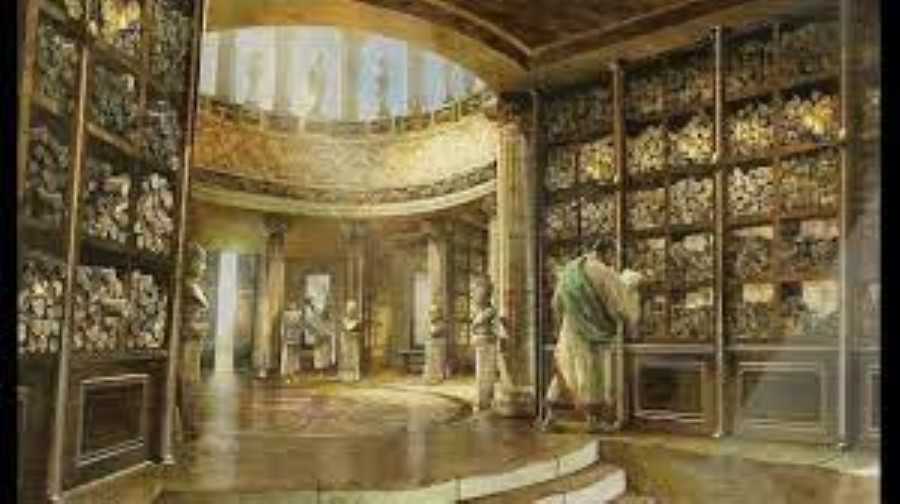

# Alexandria
A decentralized digital library in 800kb.
**********************************************************************************************************************************************************************************
 [Click here to play the audio](https://psicodata.io/CDN/mp3/libris.mp3)
libris
**********************************************************************************************************************************************************************************
# Modus operandi
* This method uses a process called 'leeching' to grab works of literature (or documents of a variety of filetypes) from anywhere in the public domain.
* The code requires 800 kb of memory space on disk . This saves 'energy' required by the processor and very liitle computaional effort resulting in lightning speed rendering.
* Zero database configuration ; just create a new 'entry' in books.json , using 'notepad++'.
* No memory space is needed to 'store' books on your bookshelf , eg , 'The Elements of Geometry' by Euclid requires 2 lines of code and an amount of 'memory' measured in bytes.
* No time wasted using search engines , or rendering unnecessary web pages ,  another win-win situation in the persuit of zero carbon without needing any 'trade-offs'.
* Decentralized.
* What you save on code and memory space allows you use high quality images in your html and favicon , load time is still lighning fast.
* (If you use Mozilla Firefox  you can drag the favicon to your desktop , rendered as the image of your choice.Re name it ,duplicate it , and store it whereever you want,then double click to open the library
for instant access).
* The interaction of the 'db' - 'logic' - gui , renders hypertext links 'on the 'fly' -reducing 'Code-bloat'.(no extra coding required for new additions).

* index.html : GUI  
* script.js : Logic
* books.json : Database

* The library comes pre-populated with some of the great works , both ancient and modern.(add more or delete as required).
* To add books to your 'bookshelf' simply create a new 'empty' entry in 'books.json' and add the 'title' of the book and the url of it's remote location.
* Internet shortcut - .url (As defined by Tim Berniers Lee , the creator of the www @CERN Large Hadron Collider in 1994).
***********************************************************************************************************************************************************************************
Mulciber

```
 MADE IN YORKSHIRE
```

************************************************************************************************************************************************************************************
